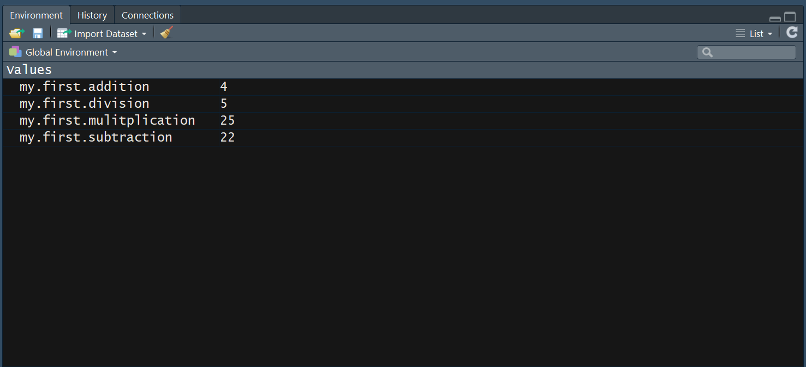

Hopefully from the introductory lecture you see the value in learning more about data analysis. And additionally, I hope you can see the value of R as a tool for data analysis. Throughout this course we're going to learn about things we can do with data to provide evidence for decisions and importantly, we're going to spend most of our time actually doing those analyses in R. But before we can focus on analytical concepts we need to gain familiarity with some R basics. This session will be a gentle introduction to R and the intended outcome is simply to feel comfortable with what R is, how to execute commands, and pick up some of the fundamental aspects of the language. 

If you don't already have R and RStudio installed then you will need to do that before proceeding. If you need guidance to do this then refer to the 'installing R' document that you can find in the learning resources on [minerva](http://minerva.leeds.ac.uk).

# Using R as a calculator

Ok so we are hoping to do much more complicated things with R than using it to add numbers together. But let's start with this as a goal to get used to executing commands in the *console*. 

The console is one of the 4 major **panes** in the RStudio window and is where we type or send commands for them to be *executed*. When a command is executed R will do the intended calculation and usually return the result of this command. 

```{r}
2 + 2
50 - 28
5 * 5
10 / 2
```

If we type these commands into the console and submit them (press enter) then R will evaluate the command by default print the result to the console. We've used R to execute our first ever commands - simple addition, subtraction, multiplication, and division. By default R simply prints the result of the calculation below the command. 

# Variables

The vast majority of the time that you execute a command in R you don't just want the result to be printed to the console, you want it to be saved so that you can come back to it later, or use it in a further calculation. To store some value for later we can **assign** it to a variable (which we can name whatever we want). So let's repeat the calculator commands but save the results by assigning them to variable names.

```{r}
my.first.addition = 2 + 2
my.first.subtraction = 50 - 28
my.first.mulitplication = 5 * 5
my.first.division = 10 / 2
```

When we execute these commands we don't see the results immediately printed to console like before. Because we have assigned the result to a variable R changes it's default behaviour because in these situations it's often the case you don't actually need to see the result, you are just saving the result to a variable to use later. This is an example of R changing it's default behaviour based on what it expects the user wants. We'll encounter some other situations where R or RStudio tries to intelligently work out what we want to do and adjust it's behaviour accordingly. 

Now that we have assigned some values to variables we can talk about another of the major RStudio panes - **the environment pane**. Here we can visually see all the variables/objects we have in our current workspace environment (the current R session, the things we have stored in memory to use). The location may be different for different people as you can change where the 4 panes appear in the **Global options** in RStudio but it will look like this after executing the previous code:



This is a nice comfort feature we get by using RStudio. We can get R to list off all the objects in our environment via a command by executing the **ls()** command:

```{r}
ls()
```

Ahhhh... functions.

# Functions

This is one of the fundamental concepts we need to understand. Everything useful we do in R is essentially executing a function that does **something** for us and then returns the result of that **something**. We likely won't need to write many of our own functions throughout this course but the best way to get an understanding of what a function is and why they are so useful is to quickly make our own as an example. 

```{r}
add.some.numbers <- function(a,b,c) {
  new.number = a + b + c
  return(new.number)
}
```

This is how a function is defined. 


A function usually takes some input that we call 'arguments'. Executes some code using these inputs and then sends back some result. Functions are particularly useful when we might be repeating blocks of code over and over again, maybe with slightly different values each time. The important thing to understand is the concept of arguments, and how a function can take different arguments (input) which will in turn affect the output. Let's use the function we've defined, after you executed the code in the chunk above the function name will appear in the environment pane. 

```{r}
add.some.numbers(1,1,1)
add.some.numbers(1,2,3)
first.number = add.some.numbers(5,10,15)
second.number = add.some.numbers(10,15,1)
first.number + second.number
```

The first time we run the function we use **(1,1,1)** as the input, so inside the function *a = 1*, *b = 1*, and *c = 1*. So when the function executes **a + b + c** it equals 3. The second time *a = 1*, *b = 2*, and *c = 3* therefore when the function executes **a + b + c** it equals 6. 

# Vectors

Now that we know how to assign values to a name to produce a variable and what functions are, let's build on that by creating a vector using a built-in R function **c()**. When we start discussing actual data analysis techniques we'll talk about variables i.e. independent variables or dependent variables, or in machine learning language 'features'. We might have a dataset we want to analyse that is the result of a survey we conducted. As part of the survey we asked participants for their age. To be able to do calculations with the ages of our participants we need to represent those ages in R. We could do this by creating a vector in R that contains the ages of our participants. 

```{r}
ages = c(18,29,34,18,19,25,45,23,31,35,45,65)
```

**c()** is a function that takes the input and produces a vector of those values. 

Print the ages vector we created:

```{r}
ages
```

# Indexing

Now that we have the ages of our participants represented as a vector we can do things with it.
```{r}
length(ages)
summary(ages)
hist(ages)
```

All these functions are part of base R. **length()** returns how many elements are in the object passed to it, so we have 12 responses for age in our data. The **summary()** function takes those 12 values and calculates a few descriptive statistics to summarise the data. The **hist()** creates a very basic histogram (more on these later) using the 12 values. 

It's common to want to select a subset of values in a vector. Let's say we want to print the age of the 4th person in these data. We can use **[] (square brackets)** to do so:

```{r}
ages[4]
```

18 is printed to the console because the 4th person in our ages vector has an age of 18. 

What if we want the age of the 4th, 5th, and 6th person?

```{r}
ages[4:6]
```

To investigate why this works try executing just **4:6** in the console to see what it does. 

You might be thinking what's the point? We can just print ages out and see what the 4th, 5th, and 6th values are. Well let's create a new vector for made-up ages:

```{r}
new.ages = sample(18:65, 10000, TRUE) # Randomly sample from the selection 18-65 10000 times
length(new.ages)
```

We now have a vector of size 10000 and I want to know the 4695th value...

```{r}
new.ages[4695]
```

As data gets bigger and bigger, using code to manage it is the only way. 

# Data Frames

The most important 'type' of object we are going to work with in R is a **data frame**. A typical analysis takes the following steps (at least):

1. Source data (this could take many formats).
2. Import data to software for analysis (R in this course).
3. Wrangle the data to get a data-frame fit for analysis.
4. Then conduct the analysis (fit model, perform hypothesis test, etc.)

Sometimes getting the data ready for analysis is the largest part of the process. A **data frame** is essentially a collection of vectors containing information where each vector is a different variable/feature. A data frame looks like what you might be used to when you think about a dataset - a spreadsheet. Let's look at a data frame that is already loaded into base R:

```{r}
data(mtcars)
```

The mtcars dataset is one of several that are included in R by default. When we execute the code above it prepares the data ready to be used in some way, notice how 'mtcars' has appeared as an object in the environment, it will say *<Promise>* until we use it. 

```{r}
class(mtcars)
```

The **class()** function will tell you what class of object the input is, so this confirms the mtcars data is setup as a dataframe. We can see there are 32 observations of 11 variables.

To learn about the mtcars dataset we can use the help features within R.

```{r}
?mtcars
```

Executing a question mark followed by the name of something in R (a built-in dataset, the name of a function, a package, etc.) will ask R to try find a help page which will describe what the object is. Functions should all have a help page which at least defines what the arguments are and a description of the intended outcome. 

RStudio allows you to view a dataset in the editor window in a format that will be familiar to most. You can bring this up by simply clicking the name of the object in the environment pane you want to view.


We can see the data frame has column names and rownames labelling what the data represent. We can access these specifically by:

```{r}
colnames(mtcars)
rownames(mtcars)
```

Generally, we want a data frame to have the format where each row is a particular observation, so in this case each row refers to a particular car, in a survey each row might represent the data for one particular person. Then each column represents one particular piece of infromation about the car/person/etc. Using the '?mtcars' help page I know the first column 'mpg' is the miles per gallon for each car, the second column 'cyl' is the number of cylinders etc. etc. 

## Subsetting/Indexing Dataframes

We saw before that we can select portions of a vector using square brackets. We can do the same for a dataframe except now we are working in two dimensions so we need to tell R what column and what row to select. We can do this by specifying two values in the square brackets:

```{r}
mtcars[3,2]
```

The first number in the square brackets selects a row and the second number selects the column. If you look at the mtcars dataset in the editor pane and look down to the third row then the second column you see that the *cyl* value for the *Datsun 710* is 4 which is what we got with the *[3,2]* indexing. 

```{r}
mtcars[1:10,2]
```

Using the : operator like we did with a vector works the same way here. This command extracts the first 10 values of the second column. 

A useful feature of data-frames is that we can also the names of the columns to pick out certain parts of the data-frame. The best way to do this is using **dollar-notation** and this works by typing the name of the data-frame, the \$ sign, then the name of the variable - **dataframe$variable**. 

```{r}
mtcars$cyl
mtcars$mpg[5]
mtcars$hp[12:19]
```

# Packages

'Packages' are what makes R so powerful. They are neatly presented portions of code that will sit in the background and add more and more powerful features to the user (so we do not need to write the code ourselves!).

Let's define a problem to use as our introduction into the power of packages:

**Your boss asks for you to collect data regarding Apple's stock price from the day the iPhone first launched to the present day. Your boss would like you to get the daily stock price data and present it in a visual format to see the trends over time.**

Now, there are plenty of places online where one can see stock price information over time. We might decide to try and find one that has a handy download button feature that will download the data into a file such as a .csv file that can be read into something like Excel. Once I find such a site, I navigate to the page for the Apple stocks and download the data. I then open said data in Excel (If I have a subscription for it) and use the menus there to come up with a suitable graph to display this data. 

Not too hard I guess. 

**After you show your boss, they say this is great work but now go and get the same information for the top 20 tech firms.**

Now we have to repeat this process again...19 more times.

If we were to use R to solve the initial problem it might look something like this.

```{r}
#install.packages("tidyquant")
library(tidyquant)
apple.stock.prices = tq_get("AAPL", get = "stock.prices", from = "2007-06-29")
library(ggplot2)
plt <- ggplot(data = apple.stock.prices, aes(x = date, y = close)) + geom_line() + theme_minimal()
print(plt)
```

Let's unpack the key parts of this chunk of code. Firstly, we found from an online search that a package already exists that makes retrieving stock data very easy. It is a problem somebody encountered and decided to create a solution for - this is how packages are born. The fact that people then publish these packages for others to use increases the power and usefulness of R every single day. The package we found that would help is called 'tidyquant'. 

Now, this is a new package to use so is unlikely to be already installed on our machine. So the first thing we need to do is install it using the function **install.packages()**. The argument to this function call is the name of the package we want to install as a string (so in quotes ""). 

A package only needs to be installed once on any given computer with an R installation. The installation downloads the necessary codebase from CRAN and puts that code somewhere on your hard drive. R does not load this code ready to use by default though. This is where the **library()** command is necesary. The **library()** function is very important and needs to be executed every **session** where you want to use it. Think of one R session as starting the moment you open R and ending when you close it. 

Once the **tidyquant** package is installed and the *library(tidyquant)* command has been executed, all the functions that are part of the tidyquant package are available to use. 

The function we want to use to get those stock prices is **tq_get**. Remember that we can get the help page for any function by:

```{r}
?tq_get
```

Note that these help pages start off a little bit daunting but they will start to make more sense as your familiarity with R increases. Either from the help page in R or by seeking examples online we learn how to use the **tq_get** function. The first argument is the character string represented the company on the stock exachange. Apple's is AAPL. Also, we want to specify a 'from' date because our task is to get the prices from the day the iPhone was released. That leads to the function call 

```{r eval=FALSE}
apple.stock.prices = tq_get("AAPL", get="stock.prices",from = "2007-06-29")
```

This gives a dataframe with all the stock price data I need. The remaining code then makes use of a different package **ggplot2** to plot the prices - we'll learn more about this next week. 

If we solved the initial request using this method, then we might not be so sad when our boss asks us to do the same for all of the top 20 tech companies. Why? Well because we can take our code and by simply changing the character string that asked for Apple stock (and changing the name of the dataframe if we want to retain the apple data) to a different company code we complete the task for that company too! e.g.

```{r}
# Notice I don't need to load any packages now as they are active from before
microsoft.stock.prices = tq_get("MSFT", get = "stock.prices", from = "2007-06-29")
library(ggplot2)
plt <- ggplot(data = microsoft.stock.prices, aes(x = date, y = close)) + geom_line() + theme_minimal()
print(plt)
```

Perfect! As our R skills progress we might see the above task and think how easy it would be to wrap that code into a function, create a vector of company identifiers and create all 20 visualisations at once...

# Scripts

The final 'basic' topic it is important to understand is the idea of keeping your code in scripts. Go to **File -> New File -> R Script** and RStudio will open a new file in the editor. This is a space where you can write your code and save it for reuse later. You can also send code to the console for execution from the script:

- CTRL + Enter / cmd + R (windows/mac)
- You can press the keyboard shortcut at any time and the whole line that the cursor is currently on will be executed. 
- Alternatively you can highlight a block of code and hit the keyboard shortcut to send ultiple commands to be executed in sequence. 

Finally, you can execute an entire script by using the **source()** command in the console and providing the filepath to the script as the argument to the function. 

Throughout this course you will be provided with numerous scripts to follow along with as we conduct analyses. 

Three small example scripts drawing on some of the topics we've discussed in today's session are uploaded to minerva titled 'exercise-1/2/3.R'. 

# Useful Links / Further Reading

'Cheatsheets' are exceptionally useful tools to have handy when doing any programming in R. If something is commmonly done in R or a package is particularly popular you'll almost certainly be able to find cheatsheets online that summarise the most common features involved in that process or package. 

[Base R Cheatsheet](https://www.povertyactionlab.org/sites/default/files/r-cheat-sheet.pdf)

[RStudio Cheatsheet](https://github.com/rstudio/cheatsheets/raw/master/rstudio-ide.pdf)

With regards further reading this week the most important thing is that you understand everything in this document. These are the basic concepts to know about R and the building blocks that will allow you to more easily follow the code as the analyses we run become more advanced. A useful introductory resource to R is the freely available (online, a print version can be purchased) *R for Data Science*. I would suggest looking at particular chapters versus reading the whole document unless you are eager to learn more about R beyond the level required for this course. The chapters listed on the left0hand side are appropriately named and you can see which ones map on to what we have covered today. 

[R for Data Science](https://r4ds.had.co.nz/index.html)

