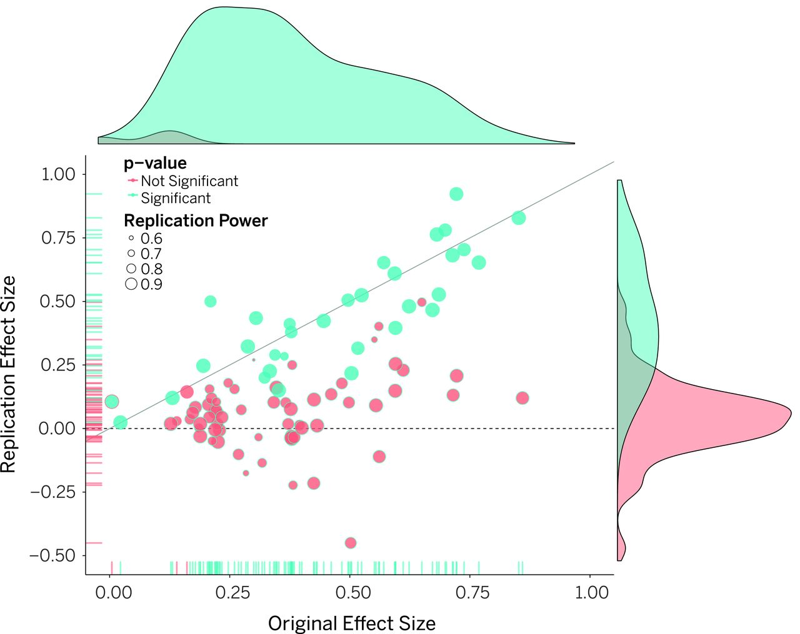
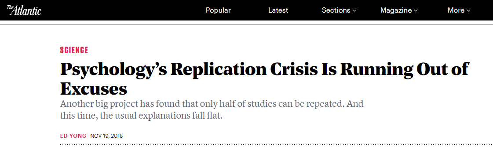
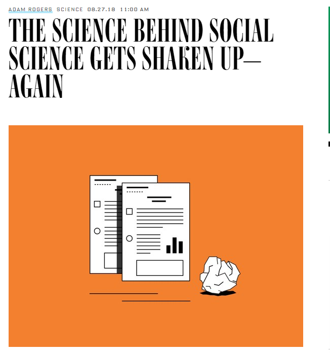
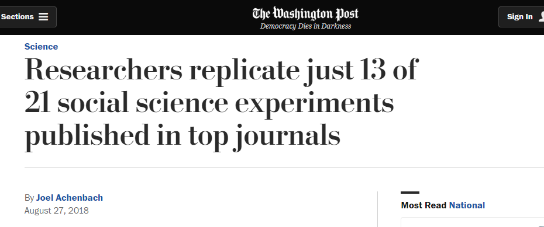
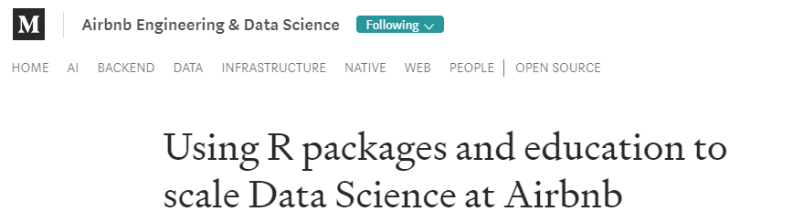
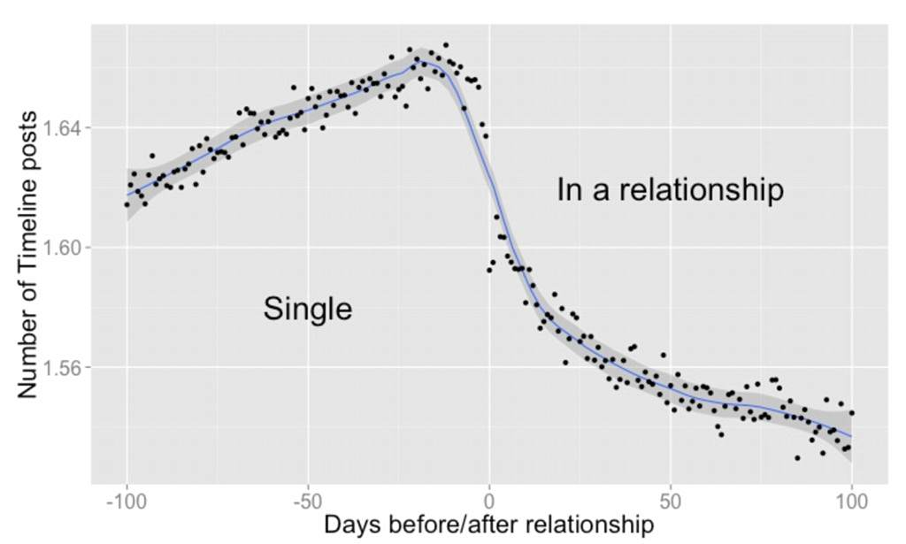

```{r setup, include=FALSE}
knitr::opts_chunk$set(echo = FALSE)
```

# Welcome 

## Overview of Course

- All things data.

- There will be plenty of discussion of statistical ideas/concepts.

- But also general 'data science' techniques/issues considered.

- How to use RStudio as the tool to use data to our advantage.

- Small Group - Allows more interaction between us.

## Less Math, More Application

- Not a course in statistical methodology and all the math that entails.

    - So we will be light on mathematical formulae and building the math up from the ground.
    
- This is a course on **application** of common data analsyis techniques though.

    - So we will be heavy on understanding how and when to use different analysis methods to investigate different types of data.
    - And importantly, gain experience **using** these analytical concepts. 
    
## Content Delivery

- General Format: Short 'lecture' introducing concepts followed by pratical session performing analysis together using RStudio. 

    - Additional Content in the form of blog-style posts building on materials in-class. Meant as extra for content if interested (or needed to understand better) not core course content. 

# Why is it important to 'understand data'?

## Employability

- Being 'data literate' enhances job prospects considerbaly in the 21st century.

- Only becoming more and more important.

- Fastest growing job markets include those with a 'data-component' to them.

    - Think 'big data', 'AI', 'machine learning'. Even if **Data Analyst/Scientist** isn't your dream job the advantage in understanding more about data is clear for roles around these areas. 
    

## Research

- Everything you're taught in the classroom has it's roots in research.

- To 'know things' requires evidence and hypothesis testing. 

- No matter what area of research one enters - a greater understanding of using data is advantageous. 

    - In fact at least a reasonable understanding of statistical methods is a pre-requisite for a good researcher regardless of topic. 

## Replication Crisis

Across all sciences to a degree but social sciences more significantly.

- Ioannidis (2005)

    - Majority of published research findings are false.
    


## Open Science Collaboration (2015)

- Estimating the reproducibility of psychological science.

    - http://science.sciencemag.org/content/349/6251/aac4716

```{r, out.width = "600px", out.height= "400px", fig.cap= "Effect size of original study plotted against the replication", echo=FALSE}


```

## Noticed outside of Academia

```{r, out.width = "100%", fig.cap= "https://www.theatlantic.com/science/archive/2018/11/psychologys-replication-crisis-real/576223/", echo=FALSE}


```

## Noticed outside of Academia II

```{r, out.height = "400px", fig.cap= "https://www.wired.com/story/social-science-reproducibility/", echo=FALSE}


```

## Noticed outside of Academia III

```{r, out.width = "100%", fig.cap= "https://www.washingtonpost.com/news/speaking-of-science/wp/2018/08/27/researchers-replicate-just-13-of-21-social-science-experiments-published-in-top-journals", echo=FALSE}


```

##

- Replication crisis not entirely due to individual researchers not understanding statistical concepts.

- Systematic issues with the field of academic research undoubtedly creates environment for 'shaky' science:

    - publish or perish.
    - fascination with the need for novelty over replication and/or null results.
    - poor peer review.
    
A greater understanding of how to derive knowledge from data - that is to make sound conclusions from data - is one key to a brighter future for social science. 


# Why use R? 

## Free and Open Source

- Free. It's free. That's enough of a reason already. 

- But also, the level of help online is so vast:
    - Google
    - Stack Overflow
    - \#rstats

## Reproducible Analysis

- Remember the replication crisis?
    - Reproducible analyses help combat the issue.
    - Someone else can see exactly how you conducted your analysis.

- You can learn more easily how to do new analyses using others as templates.

- Collaboration

- Rmarkdown

## Employability

- Knowledge of R - An in demand skill.

- Increasing usage in research and enterprise.

- Examples...

## Airbnb

https://medium.com/airbnb-engineering/using-r-packages-and-education-to-scale-data-science-at-airbnb-906faa58e12d

```{r, out.width = "100%", echo=FALSE}

```

## Facebook

```{r, out.width = "700px", out.height= "400px", fig.cap= "https://www.facebook.com/notes/facebook-data-science/the-formation-of-love/10152064609253859/", echo=FALSE}


```

## Facebook - Prophet

Prophet: Forecasting at Scale

https://research.fb.com/prophet-forecasting-at-scale/

# Today's Session

## Goals

- To get familiar with R.

    - Packages
    
    - Basic Commands
    
    - Functions
    
    - Types of Data in R
    
    - Tips/Tricks
    
- We want to get comfortable with these concepts and that will set our foundation for the data analysis to come in the following weeks.

## Contact

Office Hours (Maurice Keyworth GM.28):

    - Monday 3pm - 5pm
    - Tuesday 10am - 12pm

Gitter Chat:

    - Feel free to join, can discuss course content with instructor and your 
    classmates, remember if something is unclear to you it is almost certainly 
    unclear to other people in the class too.
    
    - Just remember that this is a public forum, one only needs the link to view. 

    - https://gitter.im/LUBS2095/community
    

