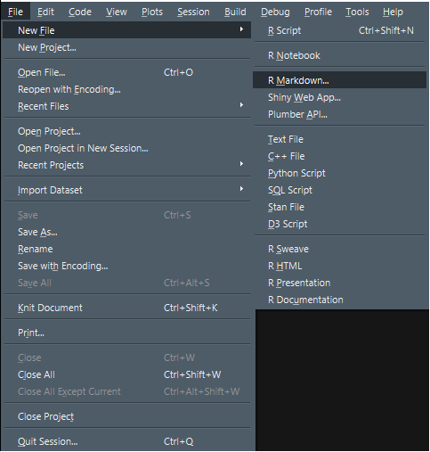
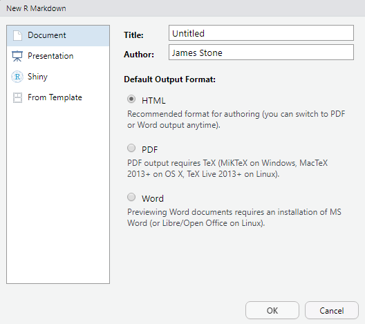
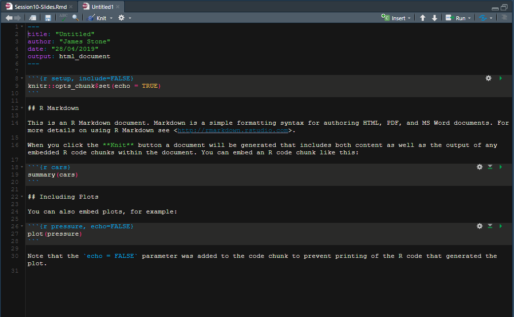
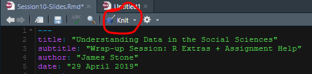
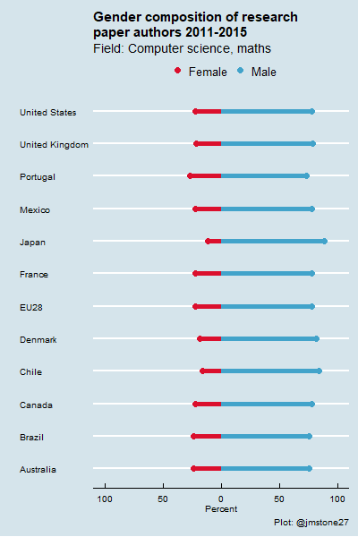
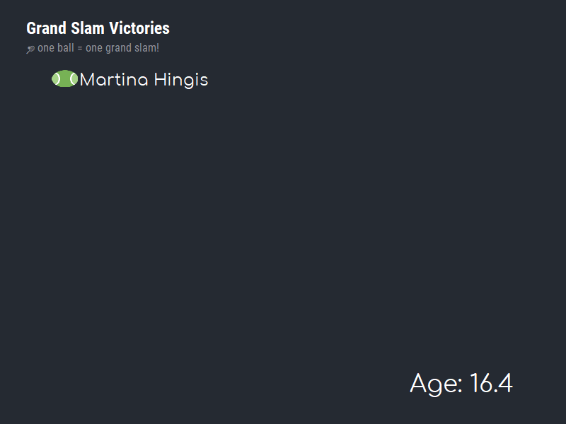

```{r setup, include=FALSE}
knitr::opts_chunk$set(echo = TRUE, out.width = "500px", fig.align = "center")
library(tidyverse)
library(ggiraph)
extrafont::loadfonts(device="win")
```

# Outline

- We've learned some analysis techniques, we've learned some R programming skills - how else can we use R to be productive in our careers?

- Communicating 
  - We've hinted at the importance of communicating analysis results in previous sessions
  - How best to communicate R results in particular?

- What has the open-source R community developed to help us do this effectively?
  - Rmarkdown
    - Slides
    - Reports
    - Blogs
  - Interactive Visualisations
    - Once we aren't limited to only Word/PDF document types our options widen significantly.

---

# Introduction

In this session you will be gently introduced to rmarkdown and interactive visualisations.

- Rmarkdown
  - Basics

- Interactive Data Vis
  - HTML doctypes allow for more interesting data vis
  - Plotly
  - Dygraphs for time-series

- Putting it together
  - Flexdashboard
  - Storyboards
  
---

class: center middle inverse

# R Markdown

```{r echo = FALSE, out.width = "350px"}
knitr::include_graphics("imgs/rmarkdown.png")
```

---

# What is R Markdown?

* A version of __Markdown__ that can be used with R to integrate R code & the outputs of R code.

* So what is Markdown? Markdown is a _lightweight markup language_ with plain text formatting syntax that can then be converted into many of the common document formats you are used to such as Word, PDF, HTML. 

* To understand what is meant by 'markup language' think about a website page - have you ever hit 'view source' in your browser. This shows you the underlying HTML code that your browser translates into the webpage you see.

* {rmarkdown} is an R package that processes and converts __.Rmd__ files into the desired output format. 

---

## Create a new `.Rmd` file in RStudio

.pull-left[
.center[

]
]

.pull-right[
.center[

]
]

---

## New `.Rmd` File

.center[

]

---

## Compile `.Rmd` File

* Compiling is the process of taking source material/code and processing it to create the desired result.

* So in the case of _rmarkdown_ docs it is the process of telling RStudio to convert our `Rmd` into whatever file type we have asked for.



Keyboard shortcut: `Ctrl + Shift + K`

---

class: center middle inverse

# Markdown syntax

---

# Titles and Text in Markdown

```
# Header 1
```

```
## Header 2
```

```
### Header 3
```

--

# Header 1

## Header 2

### Header 3

---

# Titles and Text in Markdown

```
_italic_
```

```
 *another way*
```

```
__bold__
```

```
 **another way**
```

--
 
 _italic_

 *another way*

__bold__

 **another way**

---

# Lists

Ordered and unordered lists:

.pull-left[
__Ordered__
```
1. Apples
2. Oranges
3. Bananas
```

1. Apples
2. Oranges
3. Bananas

]

.pull-right[
__Unordered__
```
 * Apples
 * Oranges
 * Bananas
```

* Apples
* Oranges
* Bananas

]

---

#More in Markdown

```
> Insert quotes
```

> Insert quotes

```
$\LaTeX$ expressions are supported
```

$\LaTeX$ expressions are supported

- Adds significant power to what you can do overall but for the average user this is commonly used when needing to include mathematical expressions.

```
$$ \frac{1}{n} \sum_{i=1}^n X_i $$
```

$$ \frac{1}{n} \sum_{i=1}^n X_i $$
Add horizontal line
```
 ***
```

***

---

#Links

Adding links to webpages is easily managed:

```
[FiveThirtyEight](https://www.fivethirtyeight.com)
```
[FiveThirtyEight](https://www.fivethirtyeight.com)

```
[BBC](https://www.bbc.co.uk)
```
[BBC](https://www.bbc.co.uk)

---

#Images

```

```
.center[

]

---

class: center middle inverse

#Code chunks

---

## Basic chunk

```{r comment=NA,echo=FALSE}
cat("```{r}\nx <- 2 + 5\nx\n```")
```

--

Output:

```{r echo = FALSE}
x <- 2 + 5
x
```

--

.pull-left[
### Echo

To display the output of a code chunk but not the underlying R code, you specify the `echo=FALSE` option

```{r comment=NA,echo=FALSE}
cat("```{r, echo=FALSE}\nx <- 2*pi \nx\n```")
```
]

--

.pull-right[
### Eval

To display R code without evaluating it, you specify the `eval=FALSE` chunk option

```{r comment=NA,echo=FALSE}
cat("```{r, eval=FALSE}\nx <- 2*pi\n```")
```
]

---

## Figures

```{r comment=NA,echo=FALSE}
cat('```{r, fig.align="center", out.width="60%"}
qplot(Sepal.Length, Sepal.Width, data = iris)
```')
```

```{r chunkfig, fig.align="center", out.width="60%", echo = FALSE}
ggplot2::qplot(Sepal.Length, Sepal.Width, data = iris)
```

---

## Figures

```{r comment=NA,echo=FALSE}
cat('```{r, fig.align="center", out.width="80%", fig.asp=0.7, fig.width=4}
qplot(Sepal.Length, Sepal.Width, data = iris)
```')
```

```{r chunkfig2, fig.align="center", out.width="80%", fig.asp=0.7, fig.width=4, echo = FALSE}
ggplot2::qplot(Sepal.Length, Sepal.Width, data = iris)
```

---

## FAQ: two figures side-by-side

```{r comment=NA,echo=FALSE}
cat('```{r, echo=FALSE, out.width="50%", fig.show="hold", fig.align="default"}\nqplot(mpg, qsec, data=mtcars) + hrbrthemes::theme_modern_rc()\nqplot(as.factor(cyl), mpg, data=mtcars, geom="boxplot") + \nhrbrthemes::theme_modern_rc()\n```')
```

```{r, fig.align="default", out.width="50%", echo=FALSE, fig.show='hold'}
qplot(mpg, qsec, data=mtcars) + hrbrthemes::theme_modern_rc()
qplot(as.factor(cyl), mpg, data=mtcars, geom="boxplot") + hrbrthemes::theme_modern_rc()
```

---

# Printing Data/tables

Rarely going to want to print off whole datasets:

```{r}
print(iris, row.names = FALSE)
```

---

# Printing tables with summary statistics

Many many packages exist to make this easier. Whether for creating the summary table in the first place or displaying the resulting table.

__{summaryTools}__ will compute some values for us and display it automatically.

__{kable}__ can be used on any R data frame, matrix, or table to improve the display.

__{flextable}__ clean and crisp table formatting. More academic.

__{DT}__ DataTable function from DT package useful for large displaying large data/table - interactive.

---

```{r results="asis"}
print(summarytools::dfSummary(iris[,1:3]), method="render")
```

---

```{r results="asis"}
knitr::kable(psych::describe(iris)[,c("mean","sd","median","min","max")], format = "html")
```

---

```{r}
psych::describe(iris)[,c("mean","sd","median","min","max")] %>%
  rownames_to_column(var="var") %>% 
  flextable::flextable() %>% flextable::autofit()
```

---

```{r}
DT::datatable(iris)
```

---

class: center middle inverse

# What can we use R Markdown for?

---

# Use R Markdown for

- Reports (analysis, etc) with text, code and results in the same place! With many possible output formats including HTML, PDF, MS Word, etc.
  - Especially when it needs to be reproducible or updated with new data.

- Notebooks (vs "Chunk Output in Console") - e.g. the worksheets provided in this course.

- Slides (like this one!

- Websites (such as [a blog](https://www.jstone.netlify.com)) can be produced mostly using R Markdown (in collaboartion with other open source technologies).

- Books using [Bookdown](https://bookdown.org/yihui/rmarkdown/)

---

## Slides formats

- [ioslides](https://bookdown.org/yihui/rmarkdown/ioslides-presentation.html) ([example](https://privefl.github.io/R-presentation/pResentation.html))

- [slidy](https://bookdown.org/yihui/rmarkdown/slidy-presentation.html) ([example](https://www.jvcasillas.com/slidify_tutorial/))

- [beamer](https://bookdown.org/yihui/rmarkdown/beamer-presentation.html) (pdf)

- [powerpoint](https://bookdown.org/yihui/rmarkdown/powerpoint-presentation.html) (ppt)

- [xaringan / remark.js](https://bookdown.org/yihui/rmarkdown/xaringan.html) (example: this presentation!)

- [reveal.js](https://bookdown.org/yihui/rmarkdown/revealjs.html)

--

<br>

3 main reasons to make your slides with R Markdown:

--

1. Include code and results very easily

--

1. Make HTML presentations directly available online (easy to export them to PDF using "print to PDF" of Chrome)

--

1. Include fancy HTML widgets (like maps, searchable tables, interactive graphics, etc)

---

class: center middle inverse

# Interactive Data Viz

---

# Interactive Data Viz

While we can use R Markdown and compile to PDF and Word for traditional static type reports we can also compile to HTML. We can leverage this power to create more interesting visualisations of our data. 

- HTML files open in the browser like websites you visit.

- Code (usually Javascript) can be included in the HTML file that adds interactive elements to the document:
  - Things happen on mouse clicks or hovers or keypresses etc. 
  
- We can use R packages that create __HTMLWidgets__ to add interactivity without needing to know any Javascript ourselves. 

---

## `ggiraph`

There are many many packages to explore to start adding interactivity to your data vis. 

Perhaps the most useful introduction to adding interactivity for us is to look at __ggiraph__.
- The __ggiraph__ package allows us to use `ggplot()` and add interactive elements, so we can build on the skills developed so far. 

---

### Static ggplot

```{r echo = FALSE, include = FALSE}
ep1_tweet_density <- readRDS("ep1_tweet_density.rds")
ep1_tweet_sentiment <- readRDS("ep1_words_sentiment.rds")
```

```{r echo = FALSE, fig.width=10, fig.height=8, out.width="650px"}
(ep1_tpm_plot <- ggplot(data = ep1_tweet_density, aes(x = timemin, y = numTweets, group = 1)) + 
    geom_line() + 
    scale_x_datetime(breaks = seq(min(ep1_tweet_density$timemin), max(ep1_tweet_density$timemin), by = 1800),
                     labels = format(seq(min(ep1_tweet_density$timemin), max(ep1_tweet_density$timemin), by = 1800), "%H:%M:%S")) +
    labs(x = "Time",
         y = "Number of OC Tweets",
         title = "Tweets Per Min During GoT",
         subtitle = "Season 8 Episode 1",
         caption = "#GameOfThrones OR #GoT") + 
    hrbrthemes::theme_ft_rc() + 
    theme(
        text = element_text(family="Comfortaa"),
        plot.subtitle = element_text(family="Comfortaa"),
        plot.title = element_text(family="Comfortaa"),
        axis.title.x = element_text(family="Comfortaa", size = 12),
        axis.title.y = element_text(family="Comfortaa", size = 12),
        axis.text.x = element_text(angle=90),
        panel.grid = element_blank()
    )
)
```
---

## GoT Tweet Density Plot

This plot is made using ggplot() exclusively with a reasonable amount of styling. 

`ggiraph` allows us to use interactive geoms in place of the static geoms in base `ggplot`. 

The line in the GoT plot is constructed using a call to `geom_line()` which you should be familiar with.

* `ggiraph` offers a `geom_point_interactive` geom. 

* `geom_point_interactive(aes(tooltip=COLNAME_WITH_VALUE_TO_SHOW))` 
* when creating the ggplot object. If we add this layer to the ggplot with a low alpha (so mostly transparent) like so:

* `geom_point_interactive(aes(tooltip = numTweets), color ="white", alpha = 0.01, size = 2)`

Then use `girafe(code = print(NAME_OF_GGOBJECT))`

---

```{r echo = FALSE, fig.width=10, fig.height=8, out.width="650px"}
ep1_tpm_plot <- ggplot(data = ep1_tweet_density, aes(x = timemin, y = numTweets, group = 1)) + 
  geom_line() + 
    geom_point_interactive(aes(tooltip = numTweets), color ="white", alpha = 0.01, size = 2) + 
    scale_x_datetime(breaks = seq(min(ep1_tweet_density$timemin), max(ep1_tweet_density$timemin), by = 1800),
                     labels = format(seq(min(ep1_tweet_density$timemin), max(ep1_tweet_density$timemin), by = 1800), "%H:%M:%S")) +
    labs(x = "Time",
         y = "Number of OC Tweets",
         title = "Tweets Per Min During GoT",
         subtitle = "Season 8 Episode 1",
         caption = "#GameOfThrones OR #GoT") + 
    hrbrthemes::theme_ft_rc() + 
    theme(
        text = element_text(family="Comfortaa"),
        plot.subtitle = element_text(family="Comfortaa"),
        plot.title = element_text(family="Comfortaa"),
        axis.title.x = element_text(family="Comfortaa", size = 12),
        axis.title.y = element_text(family="Comfortaa", size = 12),
        axis.text.x = element_text(angle=90),
        panel.grid = element_blank()
)
girafe(code = print(ep1_tpm_plot))
```

---

```{r echo = FALSE}
ep1_sent_plot <- ggplot(data = ep1_tweet_sentiment %>% 
                          filter(sentiment %in% c("anger",
                                                     "anticipation",
                                                     "fear",
                                                     "joy",
                                                     "sadness",
                                                     "surprise")),
                         aes(x = timemin, y = n, group = sentiment, colour = sentiment)) + 
        geom_line() + 
  geom_point_interactive(aes(tooltip=n), size=2, alpha=0.01) + 
        labs(x = "Time",
             y = "Volume",
             title = "Expressed Sentiment Per Min During GoT",
             subtitle = "Season 8 Episode 1",
             caption = "#GameOfThrones OR #GoT") + 
        hrbrthemes::theme_ft_rc() + 
        theme(
            text = element_text(family="Comfortaa"),
            plot.subtitle = element_text(family="Comfortaa"),
            plot.title = element_text(family="Comfortaa", size = 14),
            axis.title.x = element_text(family="Comfortaa", size = 12),
            axis.title.y = element_text(family="Comfortaa", size = 12),
            axis.text.x = element_text(angle=90),
            panel.grid = element_blank()
)

girafe(code = print(ep1_sent_plot))
```

---

## gganimate

There is also an exceptional package the helps users create animated ggplots. 

[https://gganimate.com/](https://gganimate.com/)

A few examples...

---

```{r out.height="450px", out.width="350px", echo = FALSE}

```

.footnote[
Code: https://github.com/j-stone/TidyTuesdayCode/blob/master/2019/W16_EconUpgrades/TidyTues-2019-wk16.R
]

---

<br>
<br>

```{r echo = FALSE}

```

.footnote[
Code: https://github.com/j-stone/TidyTuesdayCode/blob/master/2019/W15-Tennis-GS/TidyTuesday-TennisGSWs.R
]

---

### Include an interactive map with {leaflet}

```{r, out.width='100%', fig.height=5, echo=TRUE, warning=FALSE}
library(leaflet)
leaflet(width = "100%") %>% 
  setView(lng = -1.555046, lat = 53.806718, zoom = 15) %>% 
  addTiles(options = providerTileOptions(minZoom = 10, maxZoom = 20))
```

--- 

# Putting it all together

Here is a 'toy' storyboard analysis I put together to use as an example:

Storyboard: [http://jamesmstone.co.uk/TT-Storyboard-SeattleBikes.html](http://jamesmstone.co.uk/TT-Storyboard-SeattleBikes.html)

Code: [https://github.com/j-stone/TidyTuesdayCode/blob/master/2019/W14-Seattle-Bikes/TT-Storyboard-SeattleBikes.Rmd](https://github.com/j-stone/TidyTuesdayCode/blob/master/2019/W14-Seattle-Bikes/TT-Storyboard-SeattleBikes.Rmd)

Further Examples: [https://rmarkdown.rstudio.com/gallery.html](https://rmarkdown.rstudio.com/gallery.html)
---

# Moving Forward

The goal of this course has been to give you a flavour of the types of analysis techniques that we can use to gain insights from data.
- We only scratched the surface.

The secondary (or imo the co-main-goal) purpose was to introduce you to R programming. 

Both of these are knowledge/skills that are potentially useful across a broad range of careers going forward as well as for futher study.

Today I've tried to show you a few extra R capabilities to give you a broader sense of what you can do if you decide to keep learning. 

---

# Moving Forward II 

Some advice for further learning:

There are so many free open resources relating to R programming in general and doing data science in R. 

Books:

[R for Data Science](https://r4ds.had.co.nz/index.html)

[Efficient R Programming](https://csgillespie.github.io/efficientR/index.html)

[Advanced R](https://adv-r.hadley.nz/)

[R Markdown: Definitive Guide](https://bookdown.org/yihui/rmarkdown/)

[Learning Statistics with R](https://learningstatisticswithr.com/book/)

[Text Mining with R](https://www.tidytextmining.com/)

---

# More Books

[Introduction to Econometrics with R](https://www.econometrics-with-r.org/)

[Forcasting: Principles and Practice](https://otexts.com/fpp2/)

[Fundamentals of Data Visualization](https://serialmentor.com/dataviz/)

[R Graphics Cookbook](https://r-graphics.org/)

[Data Visualization: A Practical Introduction](https://socviz.co/)

---

# Blogs

The R community is getting larger and as a result the amount of content available for learning how to do different things has increased significantly. 

The books I've linked to are great reference tools for gaining a general skill level at R programming, standard statistics, and data viz in R.

There is a wealth of content in the form of blog posts that are of very high quality and often do a great job of showing exactly how to do one particular thing. 

Some examples:

[12 Extensions to ggplot2 for More Powerful R Visualizations](https://mode.com/blog/r-ggplot-extension-packages)

[Make Beautiful Tables with the Formattable Package](https://www.displayr.com/formattable/?utm_content=buffer7905d&utm_medium=social&utm_source=twitter.com&utm_campaign=buffer)

[A run chart is not a run chart is not a run chart](https://nhsrcommunity.com/blog/a-run-chart-is-not-a-run-chart-is-not-a-run-chart/)

[How to implement Random Forests in R](https://www.r-bloggers.com/how-to-implement-random-forests-in-r/)

[Practical Introduction to Web Scraping in R](https://www.r-bloggers.com/practical-introduction-to-web-scraping-in-r/)

[Animated Labor Force Participation Chart](http://lenkiefer.com/2019/02/06/animated-labor-force-participation-chart/)

---

# Final Things

* You'll learn programming concepts as well as what different types of analyses achieve faster by doing. 

* Take any opportunity you can find to write some code to produce a graphic or run an analysis.

* [TidyTuesday](https://github.com/rfordatascience/tidytuesday/blob/master/README.md) - Every week a new dataset released. People create data viz based on the data and post to twitter using #TidyTuesday including the code that produces the viz.
  - Some of my plots I've included in these slides were created for #TidyTuesday.
  
* \#rstats hashtag in general on twitter is a wealth of potential resources.

---

class: center, inverse, middle

# Thank You 

[https://www.twitter.com/jmstone27](https://www.twitter.com/jmstone27)
<br/>
[https://jstone.netlify.com](https://jstone.netlify.com)